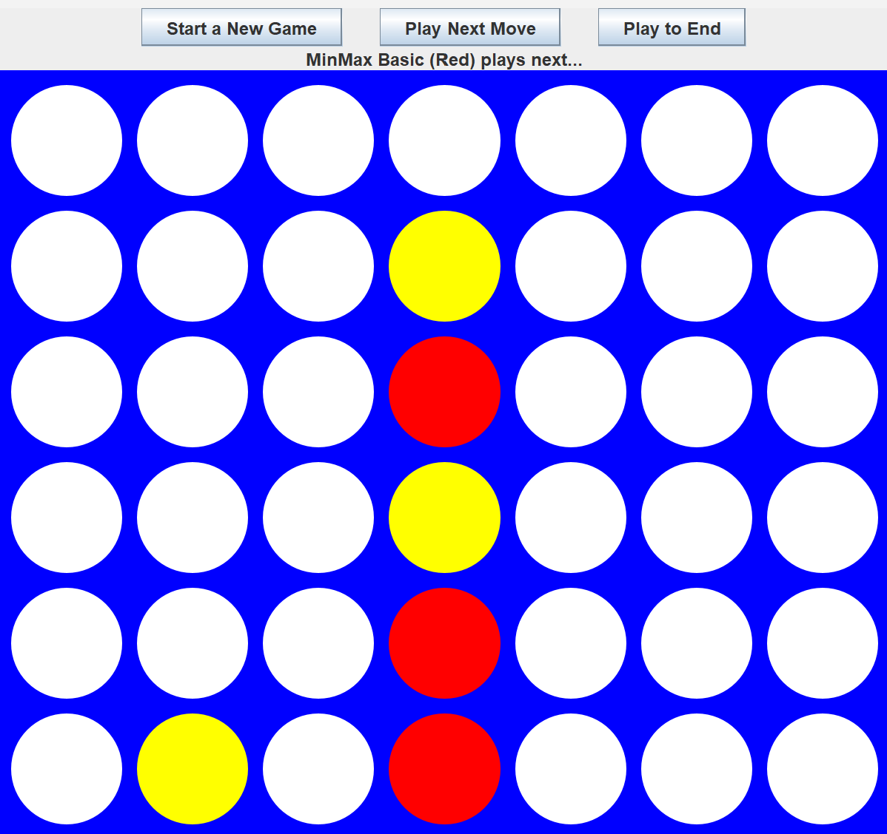

# ConnectFour-MiniMax
Simple program created for my class submission. The UI has already been provided by my teacher.
All AIs except the minimax have been created by other people.

## Program
This program runs a series of simulated Connect-4 matches with varying AIs.
Some AIs have already been provided to test the minimax algorithm. Run the main
method and it will automatically run against the teacher AI provided. Configure
the main method AI class variables to change oponnents. 
## Minimax AI

To put it simply, the minimax algorithm decides where to place each Connect Four component
by maximizing the score of both the player and the oponnent. More information on what the 
minimax algorithm is and how it is applied can be found [here](https://en.wikipedia.org/wiki/Minimax)
